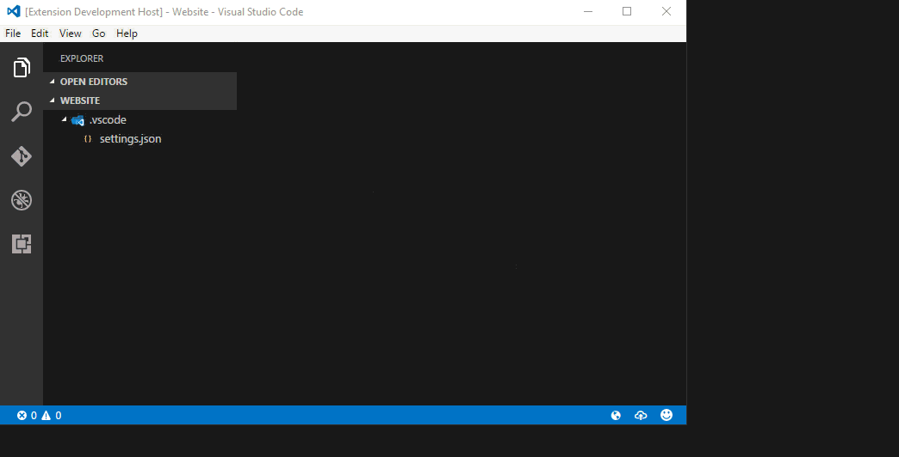
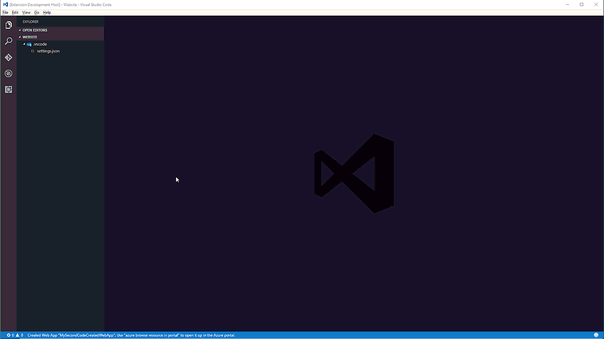

# Azure Tools for Visual Studio Code

This extension for [Visual Studio Code](http://code.visualstudio.com) gives Azure developers some convenient commands for creating or accessing resources directly in the editor. 

## Features

- Interactive Login, with support for Azure Active Directory accounts right out of the box.

     

    Microsoft accounts are also supported, so you can log in using @outlook.com, @live.com, or @hotmail.com services. To enable MSA login, add the GUID of your AAD tenant to your workspace configuration using the `azure.tenantId` setting this extension contributes.

     

- **New Feature** - All Azure regions supported! Simply click on the region-selection status bar button and select your region. 

    

- Multiple subscription support, so if you have multiple Azure subscriptions associated with your login you'll be able to switch between them easily.

    

- Browse resources in the Azure portal shows a pick list of all your resources. When clicked, you'll go right to the portal blade for that resource.

    

- Web App creation - using either an advanced or simple mode, you can create new Azure App Service Web Apps directly from within Visual Studio Code.

    Advanced mode allows you to create or select new or existing resource groups and server farms.

    

    Simple mode creates a new resource group, server farm, and Web App after typing in the name of the Web App.

    

## Extension Settings

`azure.tenantId` : The GUID specifier for the tenant you intend on authenticating against. This is *required* if you're attempting to log in using a Microsoft Account like @outlook.com, @hotmail.com, or @live.com. 

## Requirements

All dependencies are listed in [package.json](package.json). You will need an Azure subscription. If you don't yet have an Azure subscription [sign up for a free account](https://azure.microsoft.com/en-us/free/) and then you can make use of the features in this extension, not to mention all the great features Azure offers. 

## Known Issues

All feature ideas and issues should be reported using [GitHub issues](https://github.com/bradygaster/azure-tools-vscode/issues).

## Release Notes

You can find notes for each release in the [Changelog](changelog.md).